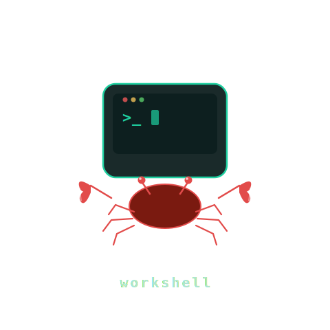

<p align="center">
  
</p>

# workshell

CLI tool that orchestrates **kitty** sessions, **zellij** layouts, and **git** branches to manage multiple AI-assisted development workspaces.

Each workspace gets its own kitty window with a zellij layout (claude + build + shell panes), and git branch tracking for task management.

## Prerequisites

**Required** (core features):
- **kitty** — terminal emulator
- **zellij** — terminal multiplexer
- **git** — branch/task management

**Optional** (monitor/window management, GNOME-specific):
- **xdotool** — window move/focus/minimize (`ws focus`, `ws rotate`, `ws capture`)
- **xprop** — window title updates (cosmetic, silently skipped if missing)
- **gdbus** — monitor detection via GNOME/Mutter (`ws focus`, `ws rotate`)

No kitty configuration needed. `ws open` launches its own kitty instances with remote control enabled and per-workspace sockets at `$XDG_RUNTIME_DIR/kitty-ws-<name>` (falls back to `/tmp`).

## Install

```bash
# Build and install to ~/.local/bin/ws
bash build.sh install
```

Or download a release binary:

```bash
ws update   # self-update to latest GitHub release
```

## Usage

### Create a workspace

Interactive wizard:

```bash
ws new
```

Or create `~/.config/workshell/workspaces/<name>.yaml` directly:

```yaml
name: myproject
dir: /home/user/myproject
default_branch: main
current_branch: main
layout: default
auto_claude: true
setup_commands:
  - "npm install"
```

### Open / close workspaces

```bash
ws open myproject    # launch kitty window + zellij session
ws close myproject   # tear down session
ws list              # show all workspaces and status
```

`ws open` launches a kitty OS window, starts zellij with the workspace layout, and (if `auto_claude: true`) runs claude in the left pane.

### Remote workspaces

```bash
ws open clawdbot1:myproject   # open workspace on remote host via SSH
ws detach clawdbot1:myproject # detach (keeps zellij session running)
ws attach clawdbot1:myproject # reattach to detached session
```

Remote hosts are configured in `~/.config/workshell/hosts.yaml` or via the dashboard settings menu.

### Task management

Tasks map to git branches with the `task/` prefix:

```bash
ws task start auth-refactor   # create + checkout task/auth-refactor
ws task list                  # show all task/* branches
ws task switch fix-bug        # stash current work, switch to task/fix-bug
ws task done                  # return to main, branch preserved for PR
```

Uncommitted changes are auto-stashed on branch switches.

Use `-w <name>` to specify a workspace when you have multiple:

```bash
ws task start foo -w myproject
```

### Monitor rotation (GNOME/Wayland)

Configure your work monitor in `~/.config/workshell/config.yaml`:

```yaml
work_monitor: DP-1
```

Then:

```bash
ws focus myproject   # move workspace window to work monitor
ws rotate            # cycle all active workspaces to work monitor
```

### Capture home positions

Arrange your workspace windows where you want them, then snapshot:

```bash
ws capture              # all active workspaces
ws capture myproject    # just one
```

### Keybindings (GNOME)

```bash
bash setup-keybindings.sh
```

This configures:

| Key | Action |
|-----|--------|
| `super+r` | `ws rotate` — cycle to next workspace on work monitor |
| `super+u` | `ws unfocus` — send focused workspace back to home position |

### Dashboard

```bash
ws dashboard
```

TUI with keyboard navigation:

```
↑/↓: navigate  Enter: open  n: new  t: tasks  d: detach  x: kill  D: delete  s: settings  Esc: quit
```

### Dependencies

```bash
ws deps check     # show status of required/optional tools
ws deps install   # install missing dependencies
```

## Default Zellij Layout

```
┌──────────────────┬─────────────────┐
│                  │     build       │
│     claude       ├─────────────────┤
│                  │     shell       │
└──────────────────┴─────────────────┘
```

Set `auto_claude: false` in workspace config to get an editor pane instead.

Custom layouts can be placed in `~/.config/workshell/layouts/`.

## File Locations

| Path | Purpose |
|------|---------|
| `~/.config/workshell/config.yaml` | Global config (default layout, work monitor) |
| `~/.config/workshell/hosts.yaml` | Remote host definitions |
| `~/.config/workshell/workspaces/` | Workspace configs |
| `~/.config/workshell/layouts/` | Zellij layout files |
| `~/.local/state/workshell/` | Runtime state (window IDs, session names) |

## Building

```bash
bash build.sh           # build ./ws
bash build.sh install   # build + copy to ~/.local/bin/ws
VERSION=1.0.0 bash build.sh  # build with specific version
```
